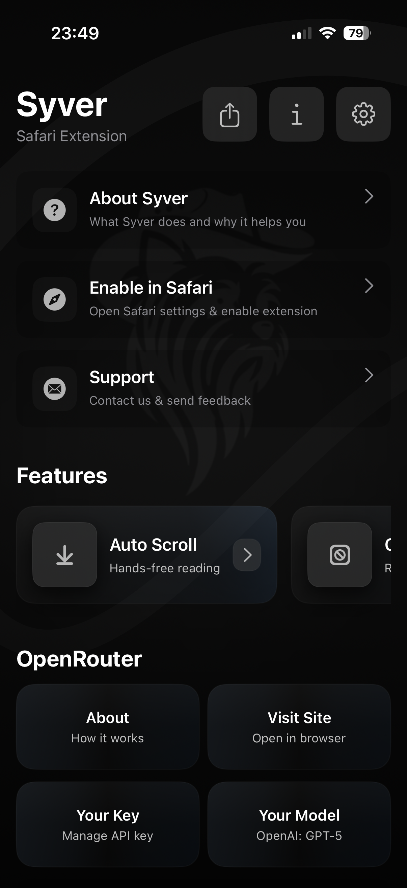
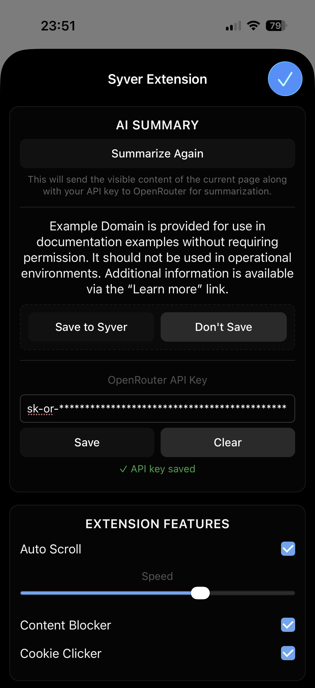
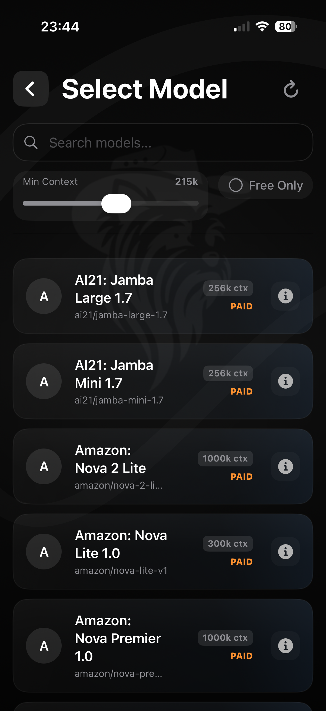
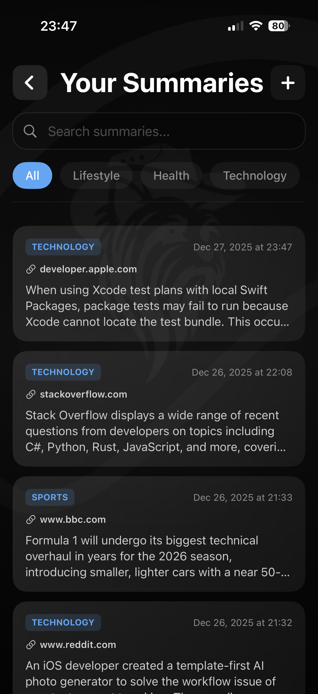
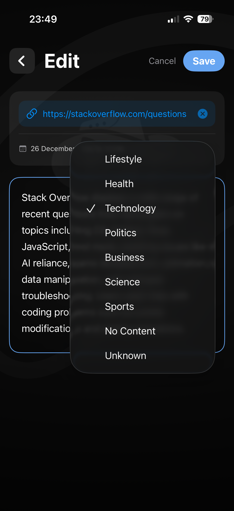
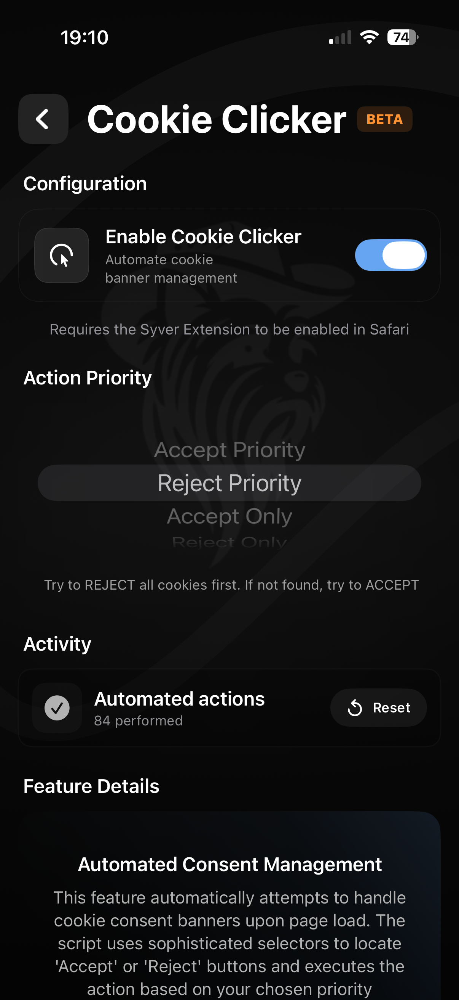

# Wiktor Drab

**iOS Developer**

Product-focused iOS Developer with hands-on experience shipping and maintaining iOS applications on the App Store.
Experienced across the full development lifecycle - from architecture and implementation to testing and automated delivery - with a strong focus on modern, scalable codebases.

---

## Live Apps

- Syver - https://apps.apple.com/app/syver/id6744258944  
- Flowt: Offshore - https://apps.apple.com/app/flowt-offshore/id6753603068  

---

## Featured Products

### **Syver**

  
  
  
  
  
  

An iOS app with a Safari Web Extension focused on browsing automation and AI-powered summaries.

- SwiftUI iOS app built using MVVM + Coordinator and a modular service layer
- Multi-feature Safari Web Extension with automation, privacy-focused features, and AI-powered summarization integrated with the iOS app
- Offline-first persistence with SwiftData and CloudKit synchronization, supporting paginated data access
- External AI API integration with TTL-based caching and retry logic with jitter
- Idempotent data synchronization between the extension and the app using CloudKit
- Lightweight backend built with Vapor, providing caching and rate limiting
- On-device text classification implemented with Core ML (models trained using Create ML)
- Unit-tested ViewModels using test doubles (fakes, stubs, spies)
- CI/CD configured with Xcode Cloud (builds, tests, archiving, TestFlight and App Store delivery)

🔗 App Store: https://apps.apple.com/app/syver/id6744258944  
🔗 iOS App & Extension: https://github.com/drab111/Syver  
🔗 Vapor Backend: https://github.com/drab111/Syver-backend  

---

### **Flowt: Offshore**

  
  
  
  
  
  <video src="Screenshots/flowt-trailer.mov" width="16%" autoplay loop muted playsinline></video>

A polished iOS strategy game built with SwiftUI and SpriteKit.

- Production game using SwiftUI as the app shell and SpriteKit for the gameplay scene
- Modular architecture with MVVM, an async service layer, and centralized app state
- Firebase Authentication (email + Sign in with Apple) and Firestore-based global leaderboard
- Game Center achievements and player profile integration
- Mock service implementations enabling offline development and deterministic testing
- Unit, integration, and UI tests with mocks, achieving over 85% test coverage
- CI/CD configured with Xcode Cloud (builds, test plans, archiving, TestFlight and App Store delivery)
- Strong focus on UI polish using animations, haptics, and sound design

🔗 App Store: https://apps.apple.com/app/flowt-offshore/id6753603068  
🔗 Public Repo: https://github.com/drab111/Flowt-public  

---

## Tech Stack

- **iOS:** Swift, SwiftUI, Swift Concurrency, Combine, SwiftData, CloudKit, SpriteKit, UIKit  
- **Architecture:** MVVM (+ Coordinator), MVC, Service Layer, Dependency Injection
- **Testing:** XCTest (unit, integration, UI), test doubles  
- **Backend:** REST APIs, Firebase (Auth, Firestore), Vapor  
- **CI/CD:** Xcode Cloud, TestFlight, App Store  
- **On-device ML:** Core ML, Create ML  

---

## Contact

- Email: wiktor.drab@icloud.com
- GitHub: https://github.com/drab111
- LinkedIn: https://linkedin.com/in/wiktor-drab-0abaa5382
